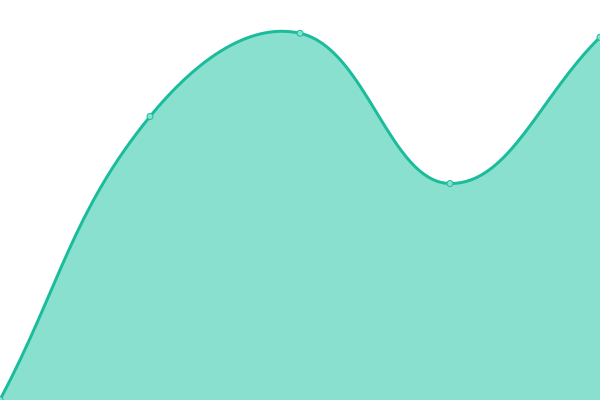

# [📈 Live Status](https://lactobionicAcid.github.io/PCL-Homepage-Status): <!--live status--> **🟧 Partial outage**

This repository contains the open-source uptime monitor and status page for [乳糖酸ちゃん 。・ω<)⌒☆](https://lactobionicAcid.github.io/PCL-Homepage-Status), powered by [Upptime](https://github.com/upptime/upptime).

With [Upptime](https://upptime.js.org), you can get your own unlimited and free uptime monitor and status page, powered entirely by a GitHub repository. We use [Issues](https://github.com/lactobionicAcid/PCL-Homepage-Status/issues) as incident reports, [Actions](https://github.com/lactobionicAcid/PCL-Homepage-Status/actions) as uptime monitors, and [Pages](https://lactobionicAcid.github.io/PCL-Homepage-Status) for the status page.

<!--start: status pages-->
<!-- This summary is generated by Upptime (https://github.com/upptime/upptime) -->
<!-- Do not edit this manually, your changes will be overwritten -->
<!-- prettier-ignore -->
| URL | Status | History | Response Time | Uptime |
| --- | ------ | ------- | ------------- | ------ |
|  [Minecraft 新闻](https://mcnews.meloong.com) | 🟩 Up | [minecraft.yml](https://github.com/lactobionicAcid/PCL-Homepage-Status/commits/HEAD/history/minecraft.yml) | 

 1921ms
     
 | 

<a href="https://lactobionicAcid.github.io/PCL-Homepage-Status/history/minecraft">100.00%</a>
    

|  [每日整合包推荐](https://pclsub.sodamc.com/) | 🟩 Up | [.yml](https://github.com/lactobionicAcid/PCL-Homepage-Status/commits/HEAD/history/.yml) | 

 565ms
     
 | 

<a href="https://lactobionicAcid.github.io/PCL-Homepage-Status/history/">90.84%</a>
    

|  [Minecraft 皮肤推荐](https://forgepixel.com/pcl_sub_file) | 🟩 Up | [minecraft.yml](https://github.com/lactobionicAcid/PCL-Homepage-Status/commits/HEAD/history/minecraft.yml) | 

 1921ms
     
 | 

<a href="https://lactobionicAcid.github.io/PCL-Homepage-Status/history/minecraft">97.95%</a>
    

|  [OpenBMCLAPI 仪表盘 Lite](https://pcl-bmcl.milu.ink/) | 🟩 Up | [open-bmclapi-lite.yml](https://github.com/lactobionicAcid/PCL-Homepage-Status/commits/HEAD/history/open-bmclapi-lite.yml) | 

 2325ms
     
 | 

<a href="https://lactobionicAcid.github.io/PCL-Homepage-Status/history/open-bmclapi-lite">100.00%</a>
    

|  [PCL 新功能说明书](https://raw.gitcode.com/WForst-Breeze/WhatsNewPCL/raw/main/Custom.xaml) | 🟥 Down | [pcl.yml](https://github.com/lactobionicAcid/PCL-Homepage-Status/commits/HEAD/history/pcl.yml) | 

 1639ms
     
 | 

<a href="https://lactobionicAcid.github.io/PCL-Homepage-Status/history/pcl">37.41%</a>
    

|  [杂志主页](http://118.195.192.193:26995/d/magazine-homepage-pcl/Custom.xaml) | 🟩 Up | [.yml](https://github.com/lactobionicAcid/PCL-Homepage-Status/commits/HEAD/history/.yml) | 

 565ms
     
 | 

<a href="https://lactobionicAcid.github.io/PCL-Homepage-Status/history/">89.42%</a>
    

|  [PCL GitHub 仪表盘](https://ddf.pcl-community.top/Custom.xaml) | 🟩 Up | [pcl-git-hub.yml](https://github.com/lactobionicAcid/PCL-Homepage-Status/commits/HEAD/history/pcl-git-hub.yml) | 

 188ms
     
 | 

<a href="https://lactobionicAcid.github.io/PCL-Homepage-Status/history/pcl-git-hub">100.00%</a>
    

|  [Minecraft 更新摘要](https://raw.gitcode.com/ENC_Euphony/PCL-AI-Summary-HomePage/raw/master/Custom.xaml) | 🟩 Up | [minecraft.yml](https://github.com/lactobionicAcid/PCL-Homepage-Status/commits/HEAD/history/minecraft.yml) | 

 1921ms
     
 | 

<a href="https://lactobionicAcid.github.io/PCL-Homepage-Status/history/minecraft">97.38%</a>
    

|  [今日新闻热点](https://pcl.wyc-w.top/index.xaml) | 🟩 Up | [.yml](https://github.com/lactobionicAcid/PCL-Homepage-Status/commits/HEAD/history/.yml) | 

 565ms
     
 | 

<a href="https://lactobionicAcid.github.io/PCL-Homepage-Status/history/">88.88%</a>
    

|  [Minecraft 芝士站](https://www.xxag.top/mkss) | 🟩 Up | [minecraft.yml](https://github.com/lactobionicAcid/PCL-Homepage-Status/commits/HEAD/history/minecraft.yml) | 

 1921ms
     
 | 

<a href="https://lactobionicAcid.github.io/PCL-Homepage-Status/history/minecraft">97.10%</a>
    

|  [整合包推荐引擎](https://qawsedrftgyhujiko.fun/pcl2/Custom.xaml) | 🟩 Up | [.yml](https://github.com/lactobionicAcid/PCL-Homepage-Status/commits/HEAD/history/.yml) | 

 565ms
     
 | 

<a href="https://lactobionicAcid.github.io/PCL-Homepage-Status/history/">88.05%</a>
    

<!--end: status pages-->

[**Visit our status website →**](https://lactobionicAcid.github.io/PCL-Homepage-Status)

## 📄 License

- Powered by: [Upptime](https://github.com/upptime/upptime)
- Code: [MIT](./LICENSE) © [Anand Chowdhary](https://anandchowdhary.com), supported by [Pabio](https://pabio.com)
- Data in the `./history` directory: [Open Database License](https://opendatacommons.org/licenses/odbl/1-0/)
