# [📈 主页状态](https://lactobionicAcid.github.io/PCL-Homepage-Status): <!--live status--> **🟧 部分无法访问**

本仓库基于 [Upptime](https://github.com/upptime/upptime) 项目构建，用于简单地监视 PCL 启动器的主页访问状态。

**⚠ 对于使用 GitCode 托管的主页，本仓库无法准确检测其访问状态。** 由于未知原因，使用 GitHub CLI 向 GitCode 发送请求时 _可能_ 会返回 HTTP 418。 
_现在加了特判，418 也算上线…… =。=_

<!--start: status pages-->
<!-- This summary is generated by Upptime (https://github.com/upptime/upptime) -->
<!-- Do not edit this manually, your changes will be overwritten -->
<!-- prettier-ignore -->
| 链接 | 状态 | 历史 | 响应时间 | 正常运行时间 |
| --- | ------ | ------- | ------------- | ------ |
|  [[2] Minecraft 新闻](https://mcnews.meloong.com) | 🟩 正常 | [2-minecraft.yml](https://github.com/lactobionicAcid/PCL-Homepage-Status/commits/HEAD/history/2-minecraft.yml) | 

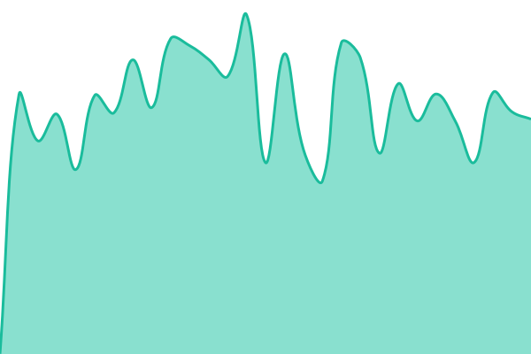 1609毫秒
     
 | 

<a href="https://lactobionicAcid.github.io/PCL-Homepage-Status/history/2-minecraft">100.00%</a>
    

|  [[4] 每日整合包推荐](https://pclsub.sodamc.com/) | 🟩 正常 | [4.yml](https://github.com/lactobionicAcid/PCL-Homepage-Status/commits/HEAD/history/4.yml) | 

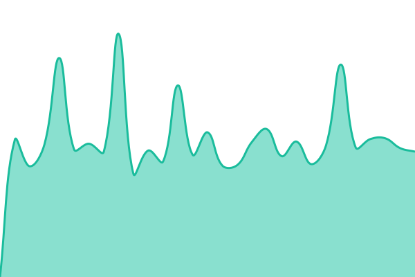 2067毫秒
     
 | 

<a href="https://lactobionicAcid.github.io/PCL-Homepage-Status/history/4">100.00%</a>
    

|  [[5] Minecraft 皮肤推荐](https://forgepixel.com/pcl_sub_file) | 🟩 正常 | [5-minecraft.yml](https://github.com/lactobionicAcid/PCL-Homepage-Status/commits/HEAD/history/5-minecraft.yml) | 

 1814毫秒
     
 | 

<a href="https://lactobionicAcid.github.io/PCL-Homepage-Status/history/5-minecraft">100.00%</a>
    

|  [[6] OpenBMCLAPI 仪表盘 Lite](https://pcl-bmcl.milu.ink/) | 🟥 无法访问 | [6-open-bmclapi-lite.yml](https://github.com/lactobionicAcid/PCL-Homepage-Status/commits/HEAD/history/6-open-bmclapi-lite.yml) | 

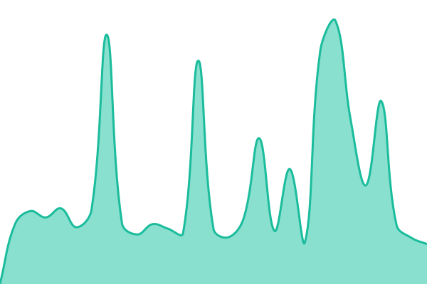 472毫秒
     
 | 

<a href="https://lactobionicAcid.github.io/PCL-Homepage-Status/history/6-open-bmclapi-lite">0.00%</a>
    

|  [[9] PCL 新功能说明书](https://raw.gitcode.com/WForst-Breeze/WhatsNewPCL/raw/main/Custom.xaml) | 🟩 正常 | [9-pcl.yml](https://github.com/lactobionicAcid/PCL-Homepage-Status/commits/HEAD/history/9-pcl.yml) | 

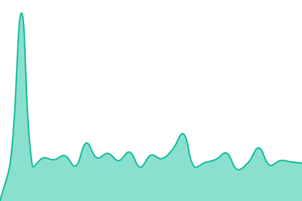 1788毫秒
     
 | 

<a href="https://lactobionicAcid.github.io/PCL-Homepage-Status/history/9-pcl">100.00%</a>
    

|  [[11] 杂志主页](http://118.195.192.193:26995/d/magazine-homepage-pcl/Custom.xaml) | 🟩 正常 | [11.yml](https://github.com/lactobionicAcid/PCL-Homepage-Status/commits/HEAD/history/11.yml) | 

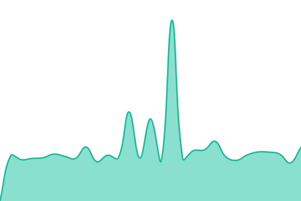 1144毫秒
     
 | 

<a href="https://lactobionicAcid.github.io/PCL-Homepage-Status/history/11">100.00%</a>
    

|  [[12] PCL GitHub 仪表盘](https://ddf.pcl-community.top/Custom.xaml) | 🟩 正常 | [12-pcl-git-hub.yml](https://github.com/lactobionicAcid/PCL-Homepage-Status/commits/HEAD/history/12-pcl-git-hub.yml) | 

 415毫秒
     
 | 

<a href="https://lactobionicAcid.github.io/PCL-Homepage-Status/history/12-pcl-git-hub">100.00%</a>
    

|  [[13] Minecraft 更新摘要](https://raw.gitcode.com/ENC_Euphony/PCL-AI-Summary-HomePage/raw/master/Custom.xaml) | 🟩 正常 | [13-minecraft.yml](https://github.com/lactobionicAcid/PCL-Homepage-Status/commits/HEAD/history/13-minecraft.yml) | 

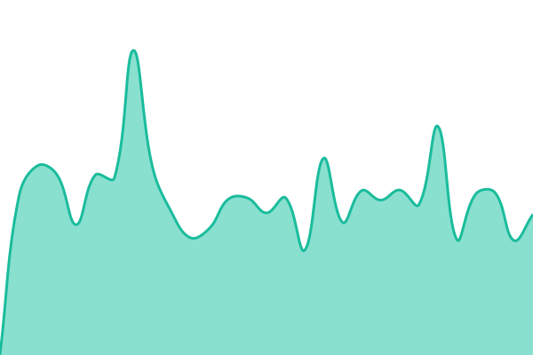 1746毫秒
     
 | 

<a href="https://lactobionicAcid.github.io/PCL-Homepage-Status/history/13-minecraft">100.00%</a>
    

|  [[14] 今日新闻热点](https://pcl.wyc-w.top/index.xaml) | 🟩 正常 | [14.yml](https://github.com/lactobionicAcid/PCL-Homepage-Status/commits/HEAD/history/14.yml) | 

 212毫秒
     
 | 

<a href="https://lactobionicAcid.github.io/PCL-Homepage-Status/history/14">100.00%</a>
    

|  [[15] Minecraft 芝士站](https://www.xxag.top/mkss) | 🟩 正常 | [15-minecraft.yml](https://github.com/lactobionicAcid/PCL-Homepage-Status/commits/HEAD/history/15-minecraft.yml) | 

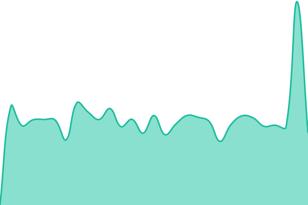 2182毫秒
     
 | 

<a href="https://lactobionicAcid.github.io/PCL-Homepage-Status/history/15-minecraft">100.00%</a>
    

|  [[16] 整合包推荐引擎](https://qawsedrftgyhujiko.fun/pcl2/Custom.xaml) | 🟩 正常 | [16.yml](https://github.com/lactobionicAcid/PCL-Homepage-Status/commits/HEAD/history/16.yml) | 

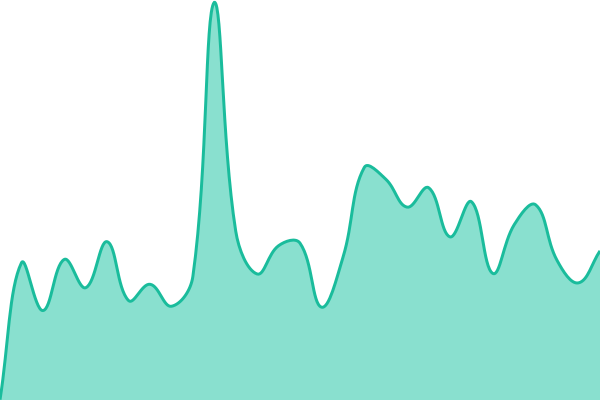 583毫秒
     
 | 

<a href="https://lactobionicAcid.github.io/PCL-Homepage-Status/history/16">100.00%</a>
    

|  [[17] Bangumi 番剧主页](https://bangumi.p.kaphia.qzz.io) | 🟩 正常 | [17-bangumi.yml](https://github.com/lactobionicAcid/PCL-Homepage-Status/commits/HEAD/history/17-bangumi.yml) | 

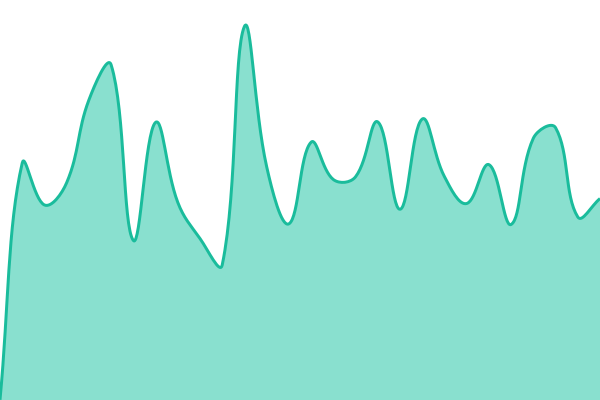 189毫秒
     
 | 

<a href="https://lactobionicAcid.github.io/PCL-Homepage-Status/history/17-bangumi">100.00%</a>
    

|  [[18] Bilibili 热门](https://bilibili.p.kaphia.qzz.io) | 🟩 正常 | [18-bilibili.yml](https://github.com/lactobionicAcid/PCL-Homepage-Status/commits/HEAD/history/18-bilibili.yml) | 

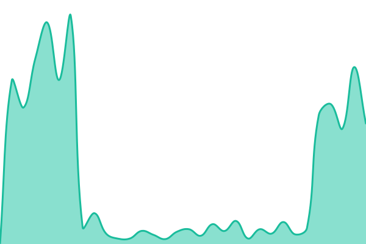 269毫秒
     
 | 

<a href="https://lactobionicAcid.github.io/PCL-Homepage-Status/history/18-bilibili">100.00%</a>
    

|  [[19] Music 云音乐热门](https://cloudmusic.p.kaphia.qzz.io) | 🟩 正常 | [19-music.yml](https://github.com/lactobionicAcid/PCL-Homepage-Status/commits/HEAD/history/19-music.yml) | 

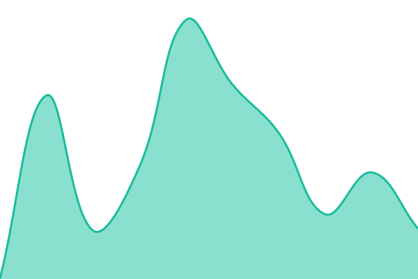 179毫秒
     
 | 

<a href="https://lactobionicAcid.github.io/PCL-Homepage-Status/history/19-music">100.00%</a>
    

<!--end: status pages-->

[**网页视图 →**](https://lactobionicAcid.github.io/PCL-Homepage-Status)

## 🕒 请求频率

由于 GitHub CLI 沟槽的拥堵程度，实际请求频率低于 **1 小时** / 次。

## 📄 License

- 技术提供: [Upptime](https://github.com/upptime/upptime)
- 开源信息: [MIT](./LICENSE) © 2026 lactobionicAcid / © [Anand Chowdhary](https://anandchowdhary.com), supported by [Pabio](https://pabio.com)
